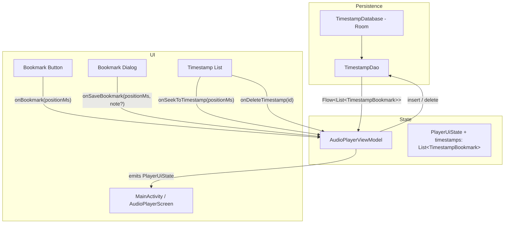
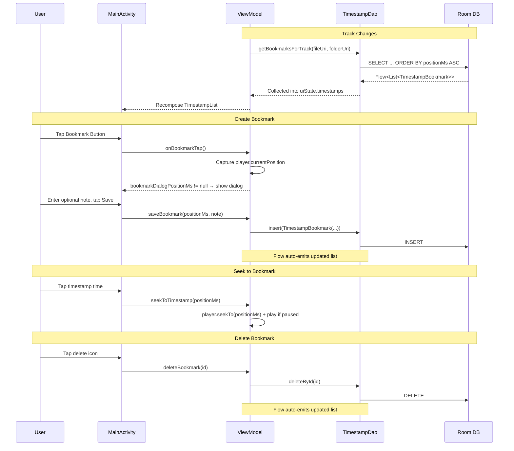

# Design Document: Audio Timestamps

## Overview

This feature adds timestamp bookmarking to the Audio Player app. Users can tap a bookmark button during playback to capture the current position, optionally attach a note, and later tap any saved bookmark to seek directly to that position. Bookmarks are persisted in a Room (SQLite) database, scoped by both audio file URI and folder URI, so switching folders never mixes bookmarks.

Room is the right tool here because timestamps are structured relational data with a one-to-many relationship (track → bookmarks) that needs querying, ordering, and filtering. DataStore is designed for flat key-value preferences and would be awkward for this use case.

The feature adds a new Room database layer (entity, DAO, database class), extends `AudioPlayerViewModel` with bookmark state and operations, and adds UI components (bookmark button, dialog, timestamp list) to `MainActivity.kt`. A pure `formatTimestamp()` utility function handles position formatting with a round-trip correctness guarantee.

## Architecture



### Key Design Decisions

1. **Room for persistence** — Timestamps are relational data (queried by file+folder, ordered by position, individually deletable). Room provides type-safe queries, Flow-based observation, and compile-time SQL verification. This is the standard Android approach for structured local data.

2. **Composite query, not composite key** — The entity uses an auto-generated `Long` primary key for simplicity. Queries filter by `(audioFileUri, folderUri)` pair. This avoids composite key complexity while still scoping bookmarks correctly.

3. **Database singleton via companion object** — Following the existing `AudioPlayerManager` singleton pattern (no DI framework), `TimestampDatabase` exposes a `getInstance(context)` companion method with double-checked locking.

4. **ViewModel collects bookmarks as Flow** — When the current track changes, the ViewModel switches to a new `Flow<List<TimestampBookmark>>` from the DAO filtered by the current track's URI and folder URI. This keeps the timestamp list reactive without manual refresh.

5. **Position captured at tap time** — When the user taps the bookmark button, the current `player.currentPosition` is captured immediately and passed to the dialog. Playback continues uninterrupted during dialog interaction.

6. **Pure formatting function** — `formatTimestamp(positionMs): String` and `parseTimestamp(formatted): Long` are pure top-level functions with no Android dependencies, making them trivially testable with property-based tests.

7. **UI stays in MainActivity.kt** — Consistent with the existing single-file UI pattern. The bookmark button goes in the playback controls area, the dialog is a standard `AlertDialog`, and the timestamp list sits between the playlist and playback controls.

## Components and Interfaces

### New Files

#### `TimestampBookmark.kt`
Contains the Room entity, DAO interface, and database class.

```kotlin
// Entity
@Entity(tableName = "timestamp_bookmarks")
data class TimestampBookmark(
    @PrimaryKey(autoGenerate = true) val id: Long = 0,
    val audioFileUri: String,
    val folderUri: String,
    val positionMs: Long,
    val note: String? = null,
    val createdAt: Long = System.currentTimeMillis()
)

// DAO
@Dao
interface TimestampDao {
    @Query("SELECT * FROM timestamp_bookmarks WHERE audioFileUri = :audioFileUri AND folderUri = :folderUri ORDER BY positionMs ASC")
    fun getBookmarksForTrack(audioFileUri: String, folderUri: String): Flow<List<TimestampBookmark>>

    @Insert
    suspend fun insert(bookmark: TimestampBookmark)

    @Query("DELETE FROM timestamp_bookmarks WHERE id = :id")
    suspend fun deleteById(id: Long)
}

// Database
@Database(entities = [TimestampBookmark::class], version = 1)
abstract class TimestampDatabase : RoomDatabase() {
    abstract fun timestampDao(): TimestampDao

    companion object {
        @Volatile private var instance: TimestampDatabase? = null

        fun getInstance(context: Context): TimestampDatabase =
            instance ?: synchronized(this) {
                instance ?: Room.databaseBuilder(
                    context.applicationContext,
                    TimestampDatabase::class.java,
                    "timestamp_bookmarks.db"
                ).build().also { instance = it }
            }
    }
}
```

#### `TimestampFormatter.kt`
Pure utility functions for formatting and parsing timestamp positions.

```kotlin
fun formatTimestamp(positionMs: Long): String {
    val totalSeconds = positionMs / 1000
    val hours = (totalSeconds / 3600).toInt()
    val minutes = ((totalSeconds % 3600) / 60).toInt()
    val seconds = (totalSeconds % 60).toInt()
    return if (hours > 0) {
        String.format(Locale.ROOT, "%d:%02d:%02d", hours, minutes, seconds)
    } else {
        String.format(Locale.ROOT, "%d:%02d", minutes, seconds)
    }
}

fun parseTimestamp(formatted: String): Long {
    val parts = formatted.split(":").map { it.toInt() }
    return when (parts.size) {
        3 -> (parts[0] * 3600L + parts[1] * 60L + parts[2]) * 1000L
        2 -> (parts[0] * 60L + parts[1]) * 1000L
        else -> throw IllegalArgumentException("Invalid timestamp format: $formatted")
    }
}
```

### Modified Files

#### `AudioPlayerViewModel.kt`
- Add `timestampDatabase` and `timestampDao` fields initialized from `TimestampDatabase.getInstance(context)`.
- Add `timestamps: List<TimestampBookmark> = emptyList()` to `PlayerUiState`.
- Add `bookmarkDialogPositionMs: Long? = null` to `PlayerUiState` (non-null when dialog is showing).
- On track change, switch the collected Flow to the new track's bookmarks using `flatMapLatest`.
- Add functions:
  - `onBookmarkTap()` — captures `player.currentPosition`, sets `bookmarkDialogPositionMs` in state.
  - `saveBookmark(positionMs: Long, note: String?)` — inserts via DAO, clears dialog state.
  - `dismissBookmarkDialog()` — clears `bookmarkDialogPositionMs`.
  - `deleteBookmark(id: Long)` — deletes via DAO.
  - `seekToTimestamp(positionMs: Long)` — calls `seekTo()` and starts playback if paused.

#### `MainActivity.kt`
- Add bookmark button (icon: `BookmarkAdd` or `Bookmark`) to the playback controls row, enabled when a track is loaded.
- Add `BookmarkDialog` composable: `AlertDialog` showing formatted position, optional `OutlinedTextField` for note, Save/Cancel buttons.
- Add `TimestampListSection` composable: displayed between playlist and playback controls, shows bookmarks for current track ordered by position. Each entry shows formatted time, optional note, and a delete icon button. Tapping the time seeks to that position.
- Wire new callbacks through `AudioPlayerScreen` parameters.

#### `app/build.gradle.kts`
- Add Room dependencies: `room-runtime`, `room-ktx`, `room-compiler` (KSP annotation processor).
- Add KSP plugin.

#### `gradle/libs.versions.toml`
- Add Room version and KSP version entries.
- Add Room library declarations.

### Interface Contracts

```kotlin
// New PlayerUiState fields
data class PlayerUiState(
    // ... existing fields ...
    val timestamps: List<TimestampBookmark> = emptyList(),
    val bookmarkDialogPositionMs: Long? = null
)

// New ViewModel functions
fun onBookmarkTap()
fun saveBookmark(positionMs: Long, note: String?)
fun dismissBookmarkDialog()
fun deleteBookmark(id: Long)
fun seekToTimestamp(positionMs: Long)

// New AudioPlayerScreen parameters
fun AudioPlayerScreen(
    // ... existing params ...
    onBookmarkTap: () -> Unit,
    onSaveBookmark: (Long, String?) -> Unit,
    onDismissBookmarkDialog: () -> Unit,
    onSeekToTimestamp: (Long) -> Unit,
    onDeleteTimestamp: (Long) -> Unit
)
```

## Data Models

### Room Entity: `TimestampBookmark`

| Field | Type | Constraints | Description |
|-------|------|-------------|-------------|
| `id` | `Long` | Primary key, auto-generate | Unique identifier |
| `audioFileUri` | `String` | Not null | SAF URI of the audio file |
| `folderUri` | `String` | Not null | SAF URI of the parent folder |
| `positionMs` | `Long` | Not null | Playback position in milliseconds |
| `note` | `String?` | Nullable | Optional user note |
| `createdAt` | `Long` | Not null | Unix timestamp of creation |

### Query Patterns

| Operation | SQL | Trigger |
|-----------|-----|---------|
| Get bookmarks for track | `SELECT * FROM timestamp_bookmarks WHERE audioFileUri = ? AND folderUri = ? ORDER BY positionMs ASC` | Track change, folder change |
| Insert bookmark | `INSERT INTO timestamp_bookmarks (...)` | User saves from dialog |
| Delete bookmark | `DELETE FROM timestamp_bookmarks WHERE id = ?` | User taps delete |

### State Flow


