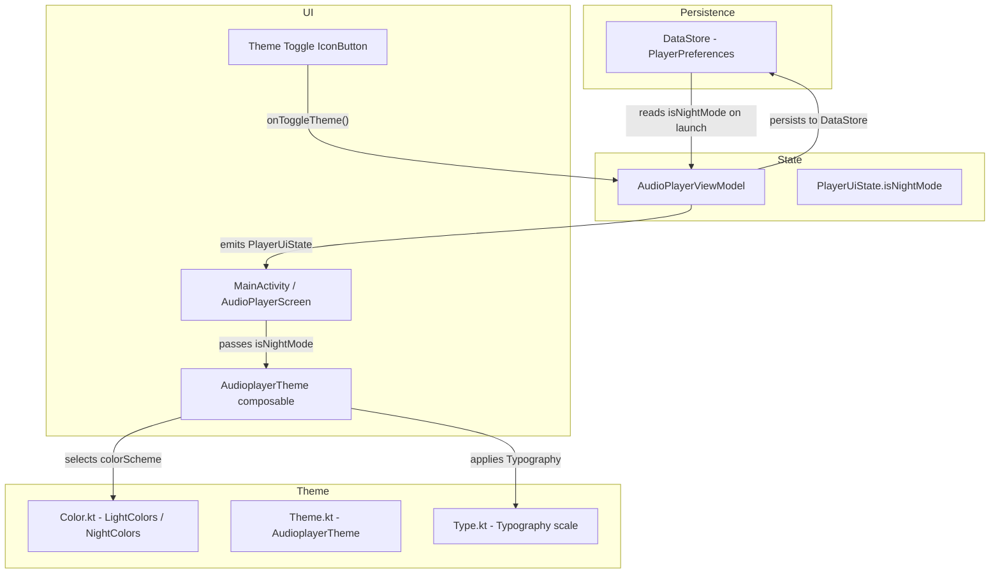
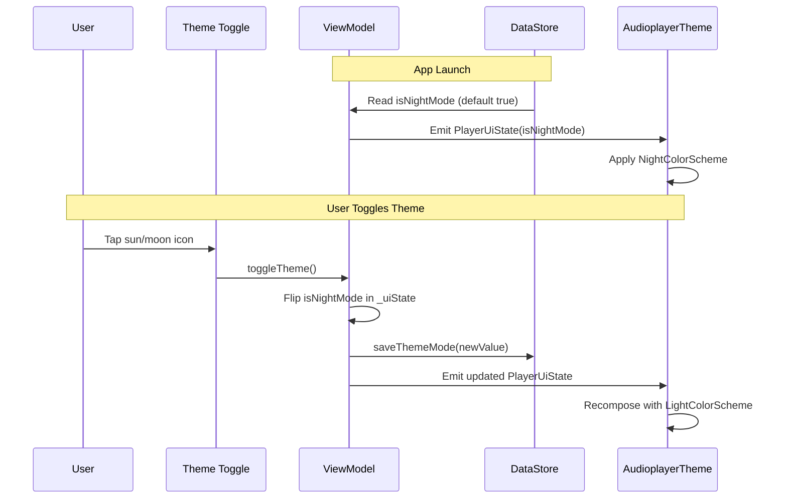

# Design Document: Theme Support

## Overview

This design replaces the current dynamic-color Material 3 theming with two hand-crafted color palettes — Light mode (creamy/warm white with dark brown accents) and Night mode (dark brown with creamy white accents). A toggle on the main player screen lets the user switch modes instantly, and the selection is persisted to DataStore so it survives app restarts.

The change touches three existing theme files (`Color.kt`, `Theme.kt`, `Type.kt`), adds a theme preference key to `PlayerPreferences`, exposes a theme state field in `AudioPlayerViewModel`, and adds a toggle button to the top app bar in `MainActivity.kt`.

## Architecture



### Key Design Decisions

1. **Theme state lives in `PlayerUiState`** — Adding an `isNightMode: Boolean` field to the existing `PlayerUiState` data class keeps theme state co-located with all other UI state. The ViewModel already manages this flow, so no new architecture is needed.

2. **Reuse `PlayerPreferences` / existing DataStore** — Rather than creating a separate DataStore instance, we add a single `booleanPreferencesKey("is_night_mode")` to the existing `PlayerPreferences`. This avoids multiple DataStore instances (which is an anti-pattern) and keeps persistence logic centralized.

3. **No enum for theme mode** — With only two modes (Light / Night), a simple `Boolean` (`isNightMode`) is sufficient. If more themes are added later, this can be refactored to an enum or sealed class.

4. **Remove dynamic color entirely** — The `AudioplayerTheme` composable currently branches on `dynamicColor` and `Build.VERSION.SDK_INT`. This is replaced with a single `isNightMode` parameter that selects between the two custom `ColorScheme` objects.

5. **System bar colors via `enableEdgeToEdge`** — Status bar and navigation bar colors are set by calling `enableEdgeToEdge()` with the appropriate style based on the active theme, ensuring they match the background.

## Components and Interfaces

### Modified Files

#### `Color.kt`
- Remove the existing `Purple80`, `PurpleGrey80`, `Pink80`, `Purple40`, `PurpleGrey40`, `Pink40` color definitions.
- Define two complete sets of named color constants:
  - Light mode palette: creamy/warm white backgrounds, dark brown primaries and text.
  - Night mode palette: dark brown backgrounds, creamy white primaries and text.

#### `Theme.kt`
- Replace `DarkColorScheme` and `LightColorScheme` with `NightColorScheme` and `LightColorScheme` built from the new color constants.
- Both schemes define all Material 3 color roles: `primary`, `onPrimary`, `primaryContainer`, `onPrimaryContainer`, `secondary`, `onSecondary`, `secondaryContainer`, `onSecondaryContainer`, `tertiary`, `onTertiary`, `background`, `onBackground`, `surface`, `onSurface`, `surfaceVariant`, `onSurfaceVariant`, `surfaceContainerLow`, `surfaceContainer`, `surfaceContainerHigh`, `error`, `onError`, `outline`, `outlineVariant`.
- `AudioplayerTheme` signature changes to `(isNightMode: Boolean, content: @Composable () -> Unit)`.
- Remove `darkTheme` and `dynamicColor` parameters and all dynamic-color logic.

#### `Type.kt`
- Expand the `Typography` definition to include `headlineMedium`, `titleLarge`, `titleMedium`, `bodyLarge`, `bodyMedium`, and `labelMedium` with explicit font weights and sizes.

#### `PlayerPreferences.kt`
- Add `IS_NIGHT_MODE_KEY = booleanPreferencesKey("is_night_mode")`.
- Add `isNightMode: Boolean` field to `PlayerPreferencesData` (default `true` for Night mode).
- Add `saveThemeMode(isNightMode: Boolean)` suspend function that writes only the theme key.
- Read `isNightMode` in the existing `preferencesFlow` mapping.

#### `AudioPlayerViewModel.kt`
- Add `isNightMode: Boolean = true` to `PlayerUiState`.
- Read theme preference on init and set initial state.
- Add `toggleTheme()` function that flips `isNightMode`, updates `_uiState`, and calls `preferences.saveThemeMode(...)`.

#### `MainActivity.kt`
- Pass `uiState.isNightMode` to `AudioplayerTheme`.
- Add `onToggleTheme` callback to `AudioPlayerScreen` parameters.
- Add an `IconButton` in the top app bar `actions` (before the folder icon) that shows a sun icon (`LightMode`) when Night mode is active and a moon icon (`DarkMode`) when Light mode is active.
- Set system bar appearance using `enableEdgeToEdge` with appropriate `SystemBarStyle` based on `isNightMode`.

### Interface Contracts

```kotlin
// PlayerPreferences additions
suspend fun saveThemeMode(isNightMode: Boolean)
// PlayerPreferencesData addition
data class PlayerPreferencesData(
    // ... existing fields ...
    val isNightMode: Boolean = true
)

// AudioplayerTheme new signature
@Composable
fun AudioplayerTheme(
    isNightMode: Boolean,
    content: @Composable () -> Unit
)

// PlayerUiState addition
data class PlayerUiState(
    // ... existing fields ...
    val isNightMode: Boolean = true
)

// ViewModel addition
fun toggleTheme()

// AudioPlayerScreen addition
fun AudioPlayerScreen(
    // ... existing params ...
    onToggleTheme: () -> Unit
)
```

## Data Models

### Color Palette Values

**Light Mode:**
| Role | Color | Hex |
|------|-------|-----|
| background | Creamy White | `#FFF8F0` |
| onBackground | Dark Brown | `#3E2723` |
| surface | Warm White | `#FFF8F0` |
| onSurface | Dark Brown | `#3E2723` |
| surfaceVariant | Light Tan | `#F0E6D6` |
| onSurfaceVariant | Medium Brown | `#6D4C41` |
| surfaceContainerLow | Soft Cream | `#FFF3E8` |
| surfaceContainer | Light Cream | `#FFEED9` |
| surfaceContainerHigh | Warm Cream | `#FFE8CC` |
| primary | Dark Brown | `#5D4037` |
| onPrimary | White | `#FFFFFF` |
| primaryContainer | Light Brown | `#D7CCC8` |
| onPrimaryContainer | Dark Brown | `#3E2723` |
| secondary | Warm Brown | `#795548` |
| onSecondary | White | `#FFFFFF` |
| secondaryContainer | Beige | `#EFEBE9` |
| onSecondaryContainer | Dark Brown | `#4E342E` |
| tertiary | Amber Brown | `#8D6E63` |
| onTertiary | White | `#FFFFFF` |
| error | Red | `#B3261E` |
| onError | White | `#FFFFFF` |
| outline | Medium Brown | `#A1887F` |
| outlineVariant | Light Brown | `#D7CCC8` |

**Night Mode:**
| Role | Color | Hex |
|------|-------|-----|
| background | Dark Brown | `#2C1E17` |
| onBackground | Creamy White | `#F5E6D3` |
| surface | Dark Brown | `#2C1E17` |
| onSurface | Creamy White | `#F5E6D3` |
| surfaceVariant | Medium Dark Brown | `#4E342E` |
| onSurfaceVariant | Light Tan | `#D7CCC8` |
| surfaceContainerLow | Deep Brown | `#3A2A20` |
| surfaceContainer | Warm Dark Brown | `#443025` |
| surfaceContainerHigh | Medium Brown | `#4E382C` |
| primary | Warm Cream | `#EFCEAD` |
| onPrimary | Dark Brown | `#3E2723` |
| primaryContainer | Brown | `#5D4037` |
| onPrimaryContainer | Light Cream | `#EFCEAD` |
| secondary | Light Tan | `#D7CCC8` |
| onSecondary | Dark Brown | `#3E2723` |
| secondaryContainer | Dark Warm Brown | `#5D4037` |
| onSecondaryContainer | Light Tan | `#D7CCC8` |
| tertiary | Soft Peach | `#FFAB91` |
| onTertiary | Dark Brown | `#3E2723` |
| error | Light Red | `#F2B8B5` |
| onError | Dark Red | `#601410` |
| outline | Medium Tan | `#A1887F` |
| outlineVariant | Dark Brown | `#4E342E` |

### DataStore Key

| Key | Type | Default | Description |
|-----|------|---------|-------------|
| `is_night_mode` | `Boolean` | `true` | `true` = Night mode, `false` = Light mode |

### State Flow




## Correctness Properties

*A property is a characteristic or behavior that should hold true across all valid executions of a system — essentially, a formal statement about what the system should do. Properties serve as the bridge between human-readable specifications and machine-verifiable correctness guarantees.*

### Property 1: Toggle inverts theme state

*For any* boolean value of `isNightMode`, calling `toggleTheme()` on the ViewModel SHALL produce a `PlayerUiState` where `isNightMode` is the logical negation of the previous value.

**Validates: Requirements 2.2**

### Property 2: Theme icon reflects current mode

*For any* boolean value of `isNightMode`, the theme toggle icon SHALL be a sun icon (`LightMode`) when `isNightMode` is `true`, and a moon icon (`DarkMode`) when `isNightMode` is `false`.

**Validates: Requirements 2.4**

### Property 3: Theme preference persistence round-trip

*For any* boolean value of `isNightMode`, saving it via `saveThemeMode()` and then reading it back via `preferencesFlow` SHALL return the same boolean value.

**Validates: Requirements 3.1, 3.2**

### Property 4: Color contrast meets accessibility minimum

*For any* color scheme (Light or Night) and *for all* foreground/background role pairs (`onBackground`/`background`, `onSurface`/`surface`, `onPrimary`/`primary`, `onPrimaryContainer`/`primaryContainer`), the WCAG contrast ratio SHALL be at least 4.5:1.

**Validates: Requirements 4.3**

### Property 5: Surface container colors provide visual depth

*For any* color scheme (Light or Night), the three surface container colors (`surfaceContainerLow`, `surfaceContainer`, `surfaceContainerHigh`) SHALL be pairwise distinct.

**Validates: Requirements 5.2**

## Error Handling

| Scenario | Handling |
|----------|----------|
| DataStore read fails on launch | Catch exception, default to `isNightMode = true` (Night mode). Log warning. No user-visible error. |
| DataStore write fails on toggle | Catch exception, keep the in-memory state change (theme still toggles visually). Log warning. Next launch may revert to previous preference. |
| Invalid/corrupt preference value | DataStore Preferences returns `null` for the key; the `?: true` default in the mapping ensures Night mode fallback. |
| Theme applied before preferences loaded | `PlayerUiState` defaults to `isNightMode = true`, so the initial frame always renders Night mode. Once DataStore emits, recomposition applies the saved preference. This avoids a flash of wrong theme in the common case (Night mode default). |

No new exceptions are introduced. All error paths are silent to the user since theme preference is non-critical — the app remains fully functional regardless of which theme is active.

## Testing Strategy

### Property-Based Testing

**Library:** [Kotest](https://kotest.io/) with the `kotest-property` module for property-based testing in Kotlin.

Each correctness property maps to a single property-based test. Tests run a minimum of 100 iterations with randomly generated inputs.

Each test is tagged with a comment referencing its design property:

```kotlin
// Feature: theme-support, Property 1: Toggle inverts theme state
```

**Property test plan:**

| Property | Test Description | Generator |
|----------|-----------------|-----------|
| 1 — Toggle inverts state | Generate random booleans for initial `isNightMode`. Set state, call `toggleTheme()`, assert result is negation. | `Arb.boolean()` |
| 2 — Icon reflects mode | Generate random booleans. Assert icon selection function returns sun for `true`, moon for `false`. | `Arb.boolean()` |
| 3 — Persistence round-trip | Generate random booleans. Save to DataStore, read back, assert equality. | `Arb.boolean()` |
| 4 — Color contrast | For each scheme, iterate all foreground/background pairs. Compute luminance-based contrast ratio, assert ≥ 4.5. | Exhaustive over both schemes × all role pairs |
| 5 — Surface container distinct | For each scheme, assert the three surface container colors are pairwise not equal. | Exhaustive over both schemes |

### Unit Testing

Unit tests complement property tests by covering specific examples and edge cases:

| Test | Description |
|------|-------------|
| Default theme is Night mode | Fresh `PlayerUiState()` has `isNightMode = true` |
| Light scheme has correct background | `LightColorScheme.background` equals `Color(0xFFFFF8F0)` |
| Night scheme has correct background | `NightColorScheme.background` equals `Color(0xFF2C1E17)` |
| No saved preference defaults to Night | `PlayerPreferencesData()` has `isNightMode = true` |
| Typography defines all required styles | `Typography` object has non-default values for `headlineMedium`, `titleLarge`, `titleMedium`, `bodyLarge`, `bodyMedium`, `labelMedium` |
| Theme composable uses Night scheme when true | `AudioplayerTheme(isNightMode = true)` provides `NightColorScheme` via `MaterialTheme.colorScheme` |
| Theme composable uses Light scheme when false | `AudioplayerTheme(isNightMode = false)` provides `LightColorScheme` via `MaterialTheme.colorScheme` |
| Dynamic color is removed | `AudioplayerTheme` no longer accepts `dynamicColor` parameter |
