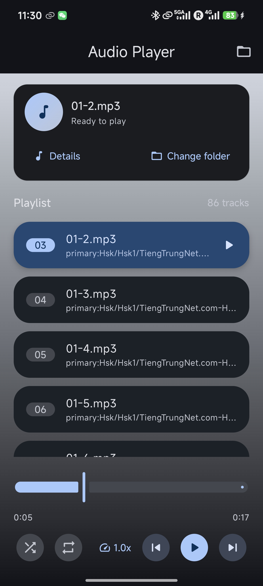
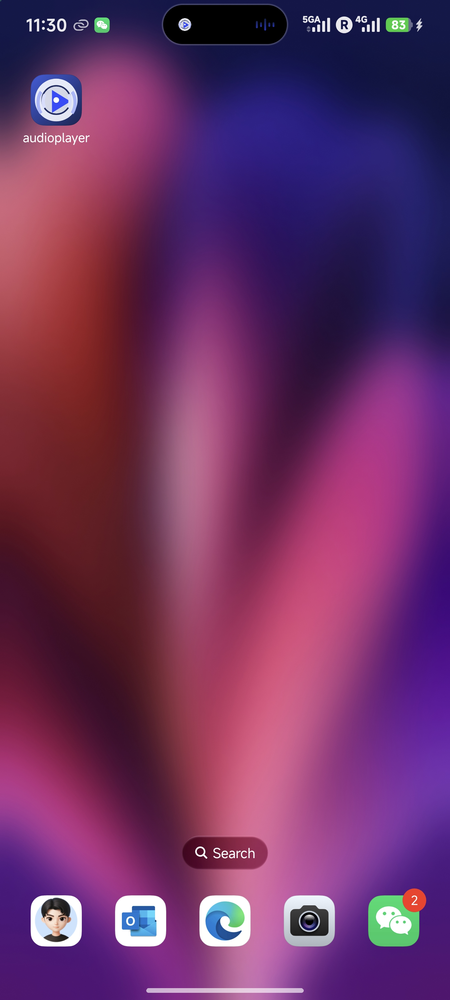
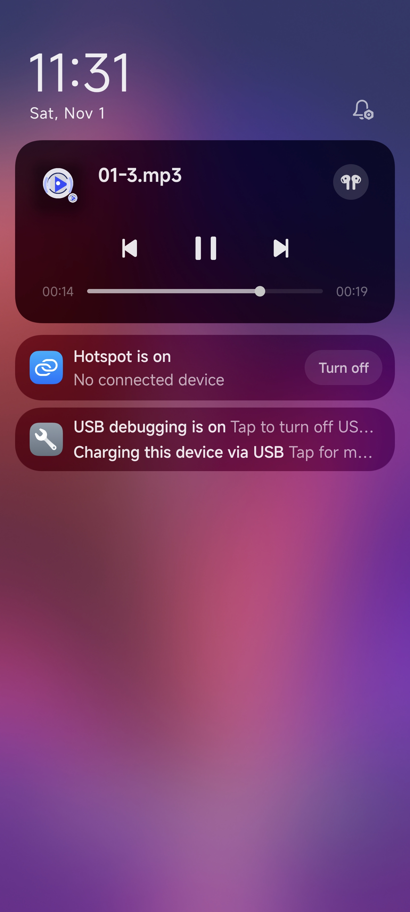
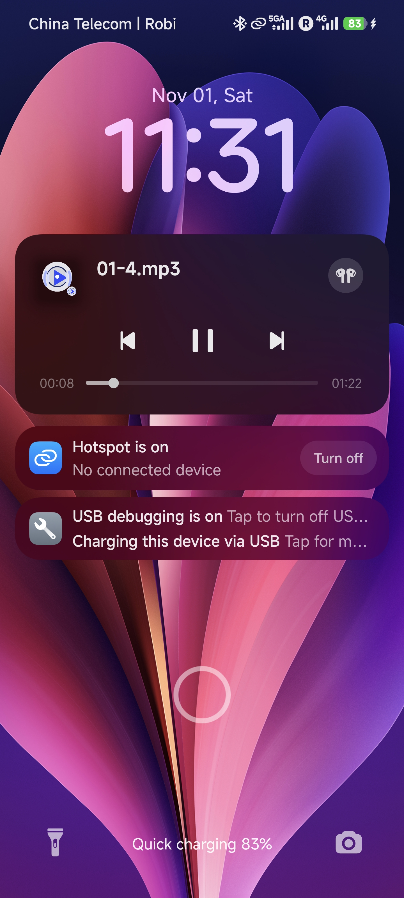
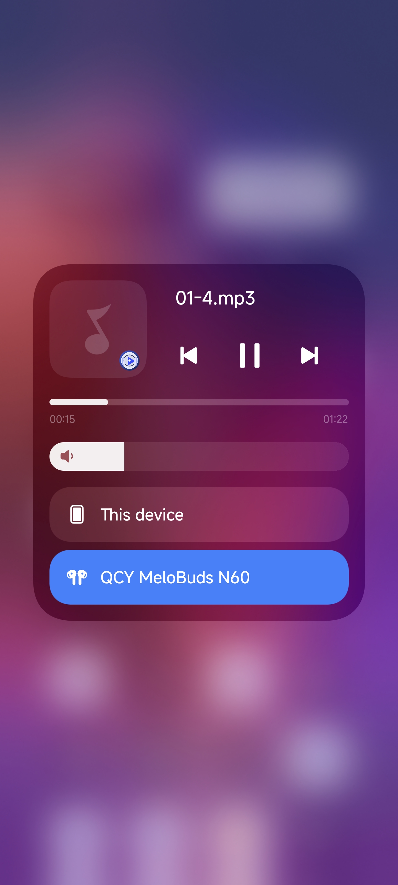

# Audio Player for Android

A polished audio playback app tailored for my personal library. I wanted something modern, reliable, and beautiful to use every day, so this project focuses on the practical features I care about most.

## Highlights
- **Folder-based playlists** – choose any folder on device storage and the app automatically builds a clean playlist for those tracks.
- **Persistent playback** – the chosen folder, current track, playback position, shuffle/repeat modes, and speed all come back exactly where I left them.
- **Modern UI** – Material 3 design with compact controls, haptic feedback on the important actions, and a tidy track detail sheet for metadata.
- **Background ready** – runs as a proper foreground media service, so playback continues safely when the app is closed, with lockscreen and notification controls.
- **Dynamic scroll** – the active song always stays in view; the playlist auto-scrolls whenever I move to the next or previous track.

## Screenshots

|  | |  |
| --- | --- | --- |
|  |  |  |

|  | |
| --- | --- |
|  |  |

## Tech Stack
- Kotlin + Jetpack Compose
- Media3 ExoPlayer & MediaSession
- DataStore (for preferences)
- Android 12+ compatible (min SDK 31)

